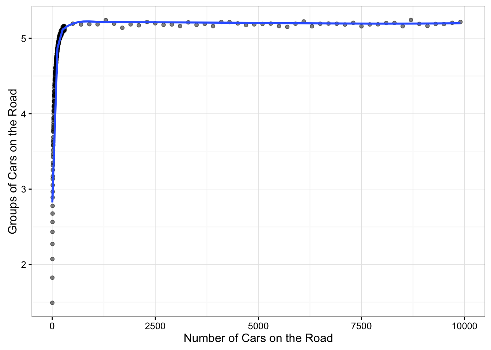

# Average Car Group Size
Benjamin Soltoff  
February 5, 2016  


```r
require(dplyr)
library(foreach)
library(doParallel)
```

```
## Loading required package: iterators
```

```
## Loading required package: parallel
```

```
## 
## Attaching package: 'parallel'
```

```
## The following objects are masked from 'package:snow':
## 
##     clusterApply, clusterApplyLB, clusterCall, clusterEvalQ,
##     clusterExport, clusterMap, clusterSplit, makeCluster,
##     parApply, parCapply, parLapply, parRapply, parSapply,
##     splitIndices, stopCluster
```

```r
require(ggplot2)

set.seed(11091987)

car_groups <- function(n_car = 100, n_trial = 100){
  # simulate speeds
  cars <- replicate(n_trial, sample(1:100, n_car, replace = TRUE))

  # get cumulative minimum speeds
  cars_min <- apply(cars, 2, cummin)
  
  # unique groups
  groups <- apply(cars_min, 2, FUN = function(x) length(unique(x)))
  
  # number of groups
  mean(groups)
}
```


```r
# set constants
n_cars <- 2^(1:16)

# register cluster
cores <- 4
cl <- makeCluster(cores)
registerDoParallel(cl)

system.time({
  trials <- data_frame(n_car = n_cars,
           groups = mclapply(n_cars, car_groups, n_trial = 10000) %>%
             unlist)
})
```

```
##    user  system elapsed 
##      37      11      98
```

```r
stopCluster(cl)
```


```r
ggplot(trials, aes(n_car, groups)) +
  geom_point(alpha = .5) +
  geom_line() +
  # geom_smooth(se = FALSE) +
  ylim(0, ceiling(max(trials$groups))) +
  labs(x = "Number of Cars on the Road",
       y = "Groups of Cars on the Road") +
  theme_bw()
```


