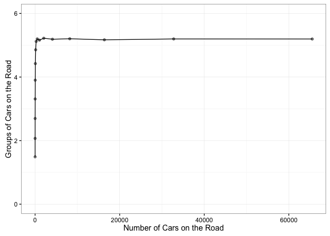

# Average Car Group Size
Benjamin Soltoff  
February 5, 2016  


```r
require(dplyr)
library(foreach)
library(doParallel)
require(ggplot2)

set.seed(11091987)

car_groups <- function(n_car = 100, n_trial = 100){
  # simulate speeds
  cars <- replicate(n_trial, runif(n_car, 0, 5e5))

  # get cumulative minimum speeds
  cars_min <- apply(cars, 2, cummin)
  
  # unique groups
  groups <- apply(cars_min, 2, FUN = function(x) length(unique(x)))
  
  # number of groups
  mean(groups)
}
```


```r
# set constants
n_cars <- 2^(1:16)
n_cars
```

```
##  [1]     2     4     8    16    32    64   128   256   512  1024  2048
## [12]  4096  8192 16384 32768 65536
```

```r
# register cluster
cores <- 4
cl <- makeCluster(cores)
registerDoParallel(cl)

system.time({
  trials <- data_frame(n_car = n_cars,
           groups = mclapply(n_cars, car_groups, n_trial = 10000) %>%
             unlist)
})
```

```
##    user  system elapsed 
##      52      33     223
```

```r
stopCluster(cl)
```


```r
ggplot(trials, aes(n_car, groups)) +
  geom_point(alpha = .5) +
  geom_line() +
  # geom_smooth(se = FALSE) +
  ylim(0, ceiling(max(trials$groups))) +
  labs(x = "Number of Cars on the Road",
       y = "Groups of Cars on the Road") +
  theme_bw()
```


