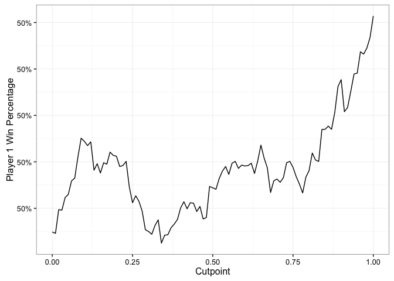
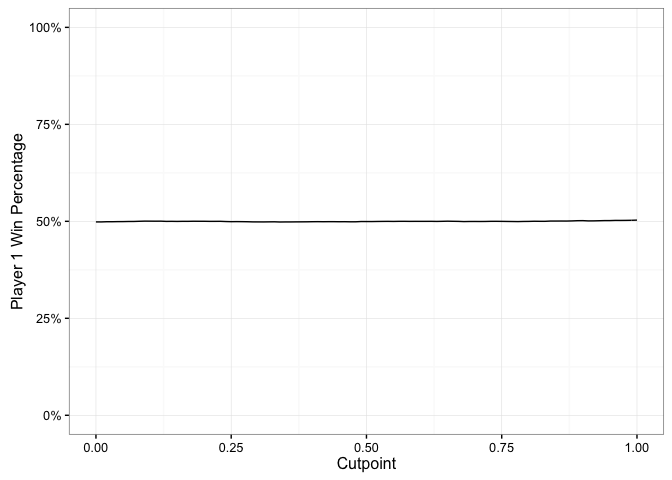
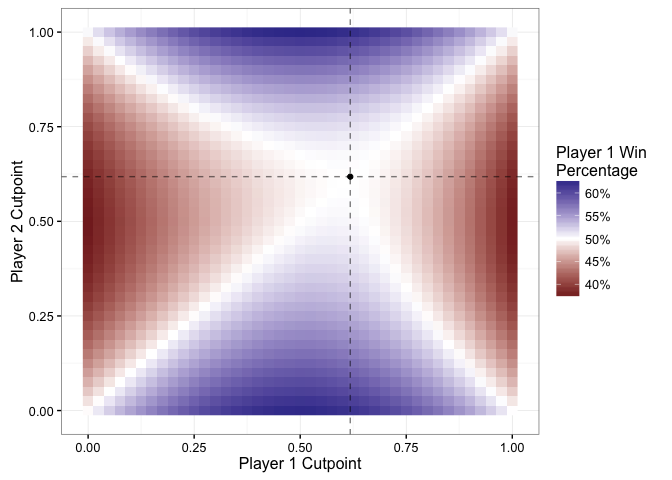

# Can You Win This Hot New Game Show?
Benjamin Soltoff  
March 6, 2016  


So the latest [Riddler puzzle on FiveThirtyEight](http://fivethirtyeight.com/features/can-you-win-this-hot-new-game-show/) goes like this:

> Two players go on a hot new game show called “Higher Number Wins.” The two go into separate booths, and each presses a button, and a random number between zero and one appears on a screen. (At this point, neither knows the other’s number, but they do know the numbers are chosen from a standard uniform distribution.) They can choose to keep that first number, or to press the button again to discard the first number and get a second random number, which they must keep. Then, they come out of their booths and see the final number for each player on the wall. The lavish grand prize — a case full of gold bullion — is awarded to the player who kept the higher number. Which number is the optimal cutoff for players to discard their first number and choose another? Put another way, within which range should they choose to keep the first number, and within which range should they reject it and try their luck with a second number?

First let's simulate some rounds of play. The following code will generate 100,000 rounds of play between two players. For the sake of efficiency, we will draw twice for each player now and consider how the selection of the first or second number influences the outcome of the game.


```r
require(dplyr)
require(magrittr)
require(ggplot2)

set.seed(938747)

# number of rounds to play
n_draw <- 100000
```


```r
p1 <- cbind(runif(n_draw), runif(n_draw))
p2 <- cbind(runif(n_draw), runif(n_draw))

head(p1)
```

```
##      [,1]  [,2]
## [1,] 0.53 0.051
## [2,] 0.87 0.606
## [3,] 0.19 0.211
## [4,] 0.12 0.261
## [5,] 0.87 0.478
## [6,] 0.24 0.389
```

```r
head(p2)
```

```
##      [,1] [,2]
## [1,] 0.82 0.72
## [2,] 0.44 0.24
## [3,] 0.63 0.56
## [4,] 0.76 0.43
## [5,] 0.84 0.34
## [6,] 0.45 0.77
```

Let's consider a very simple strategy first: no matter what happens, always keep the first number. After all, the number is generated randomly so there is no guarantee that the second number will be larger than the first number. How well does player 1 do if both players employ this strategy?


```r
sum(p1[,1] > p2[,1]) / n_draw
```

```
## [1] 0.5
```

With this strategy, each player has a roughly 50% chance of winning the game. We can also see this is the same if each player always keeps the second number.


```r
sum(p1[,2] > p2[,2]) / n_draw
```

```
## [1] 0.5
```

Okay, so this strategy is a bit naive. Why not be more sophisticated? Perhaps instead, players will only take the second number if their first number is low. An arbitrary cutpoint might be $.5$. That is, if either player gets a number less than $.5$ in the first draw, they will take whatever they get in the second draw. How does this strategy work? Here I write a short function to select the appropriate value from each round based on a specified cutpoint.


```r
cutoff <- function(draw, cutpoint = .5){
  ifelse(draw[, 1] < cutpoint, draw[, 2], draw[, 1])
}

sum(cutoff(p1) > cutoff(p2)) / n_draw
```

```
## [1] 0.5
```

Hmm, not particularly helpful here. Each player still has a roughly 50% chance of winning the game.

What about other cutpoints? Maybe $.5$ just is not an optimal cutpoint.


```r
cutpoints <- seq(0, 1, by = .01)
results <- lapply(cutpoints,
                  function(cutpoint) sum(cutoff(p1, cutpoint = cutpoint) >
                                           cutoff(p2, cutpoint = cutpoint))) %>%
  unlist

results_full <- data_frame(cutpoint = cutpoints,
                           win = results,
                           win_prop = win / n_draw)
results_full
```

```
## Source: local data frame [101 x 3]
## 
##    cutpoint   win win_prop
##       (dbl) (int)    (dbl)
## 1      0.00 49849   0.4985
## 2      0.01 49846   0.4985
## 3      0.02 49897   0.4990
## 4      0.03 49896   0.4990
## 5      0.04 49923   0.4992
## 6      0.05 49930   0.4993
## 7      0.06 49959   0.4996
## 8      0.07 49965   0.4996
## 9      0.08 50011   0.5001
## 10     0.09 50051   0.5005
## ..      ...   ...      ...
```


```r
results_plot <- ggplot(results_full, aes(cutpoint, win_prop)) +
  geom_line() +
  scale_y_continuous(labels = scales::percent) +
  labs(x = "Cutpoint",
       y = "Player 1 Win Percentage") +
  theme_bw()
results_plot
```



Hmm, something seems to be going on here - we see a positive correlation with cutpoints greater than $.3$. Oh wait, what's that?


```r
results_plot +
  scale_y_continuous(labels = scales::percent, limits = c(0, 1))
```

```
## Scale for 'y' is already present. Adding another scale for 'y', which
## will replace the existing scale.
```



Oh yeah. There really is not any significant change occurring here.

## Bring on the Calculus

Okay, so the issue with this analysis thus far is that this assumes the same strategies by both players. What would happen if two players do not use the same cutpoint? After all, the players cannot communicate with one another so there is no reason to expect that they would choose the same cutpoint. Let's consider what happens if player 1 takes the second number if her first number is less than $.5$, but player 2 only takes the second number if his first number is less than $.9$.


```r
cutoff_2 <- function(p1, p2, cut1 = .5, cut2 = .5){
  sum(cutoff(p1, cutpoint = cut1) > cutoff(p2, cutpoint = cut2))
}

cutoff_2(p1, p2, cut1 = .5, cut2 = .9) / n_draw
```

```
## [1] 0.57
```

Hmm, now we're on to something. Player 1 wins 57% of the rounds. But what if Player 2 knows this and adjusts his cutpoint? And Player 1, expecting this, adjusts her's? Essentially, we want to determine the equilibrium strategy for this game.

### Analytical Solution

So full disclosure: I didn't do the math on this one. md46135 did the calculus and the full explanation can be found [here](http://forumserver.twoplustwo.com/showpost.php?p=49516577&postcount=10). The full probability equation is as follows (here, player 1 is named **hero** and player 2 is named **villain**):

[$$\Pr(H = 1) = - \frac{1}{2}(h^2 - 1)v + h \left( - \frac{h^2}{2} + (h - 1)v + \frac{1}{2} \right) + \frac{hv}{2} - \frac{v^2}{2} + (v - 1) v + \frac{1}{2}$$](https://www.wolframalpha.com/input/?i=(h*v)%2F2+%2B+v*(v+-+1)+-+v%5E2%2F2+%2B+h*(v*(h+-+1)+-+h%5E2%2F2+%2B+1%2F2)+-+(v*(h%5E2+-+1))%2F2+%2B+1%2F2)

In order to calculate the equilibrium strategy for both players, calculate the partial derivatives with respect to $h$ and $v$

[$$\frac{\partial \Pr(H = 1)}{\partial h} = \frac{1}{2} (-3h^2 + 2hv -v + 1)$$](https://www.wolframalpha.com/input/?i=(h*v)%2F2+%2B+v*(v+-+1)+-+v%5E2%2F2+%2B+h*(v*(h+-+1)+-+h%5E2%2F2+%2B+1%2F2)+-+(v*(h%5E2+-+1))%2F2+%2B+1%2F2+partial+derivative+with+respect+to+h)

[$$\frac{\partial \Pr(H = 1)}{\partial v} = \frac{1}{2} (h^2 - h + 2v - 1)$$](https://www.wolframalpha.com/input/?i=(h*v)%2F2+%2B+v*(v+-+1)+-+v%5E2%2F2+%2B+h*(v*(h+-+1)+-+h%5E2%2F2+%2B+1%2F2)+-+(v*(h%5E2+-+1))%2F2+%2B+1%2F2+partial+derivative+with+respect+to+v)

Then set each derivative equal to 0, and solve for the appropriate values of $h$ and $v$.

[$$h = \frac{\sqrt{5}}{2} - \frac{1}{2}, v = \frac{\sqrt{5}}{2} - \frac{1}{2} $$](https://www.wolframalpha.com/input/?i=v%2F2+-+h*v+-+h*(h+-+v)+%2B+v*(h+-+1)+-+h%5E2%2F2+%2B+1%2F2%3D0,++h%2F2+%2B+v+%2B+h*(h+-+1)+-+h%5E2%2F2+-+1%2F2%3D0)

### Simulation Solution

We can also use R to find this solution via [Monte Carlo simulation](https://en.wikipedia.org/wiki/Monte_Carlo_method). This I solved myself. Essentially we do a [grid search](https://en.wikipedia.org/wiki/Hyperparameter_optimization#Grid_search) over possible combinations of two player cutpoints and find the values which leave each player winning as close to 50% of the rounds as possible.


```r
cut_lite <- seq(0, 1, by = .025)

cut_combo <- expand.grid(cut_lite, cut_lite) %>%
  tbl_df %>%
  rename(cut1 = Var1, cut2 = Var2) %>%
  mutate(p1_win = apply(., 1, FUN = function(x) cutoff_2(p1, p2, cut1 = x[1], cut2 = x[2])),
         p1_prop = p1_win / n_draw)
cut_combo
```

```
## Source: local data frame [1,681 x 4]
## 
##     cut1  cut2 p1_win p1_prop
##    (dbl) (dbl)  (int)   (dbl)
## 1  0.000     0  49849  0.4985
## 2  0.025     0  51071  0.5107
## 3  0.050     0  52301  0.5230
## 4  0.075     0  53432  0.5343
## 5  0.100     0  54427  0.5443
## 6  0.125     0  55381  0.5538
## 7  0.150     0  56270  0.5627
## 8  0.175     0  57164  0.5716
## 9  0.200     0  57962  0.5796
## 10 0.225     0  58657  0.5866
## ..   ...   ...    ...     ...
```


```r
ggplot(cut_combo, aes(cut1, cut2, fill = p1_prop)) +
  geom_raster() +
  # geom_line(data = results_full, aes(cutpoint, cutpoint, fill = NULL)) +
  geom_vline(xintercept = sqrt(5) / 2 - (1 / 2), linetype = 2, alpha = .5) +
  geom_hline(yintercept = sqrt(5) / 2 - (1 / 2), linetype = 2, alpha = .5) +
  geom_point(data = data_frame(x = sqrt(5) / 2 - (1 / 2),
                               y = sqrt(5) / 2 - (1 / 2)),
             aes(x, y, fill = NULL)) +
  scale_fill_gradient2(midpoint = .5, labels = scales::percent) +
  labs(x = "Player 1 Cutpoint",
       y = "Player 2 Cutpoint",
       fill = "Player 1 Win\nPercentage") +
  theme_bw()
```




