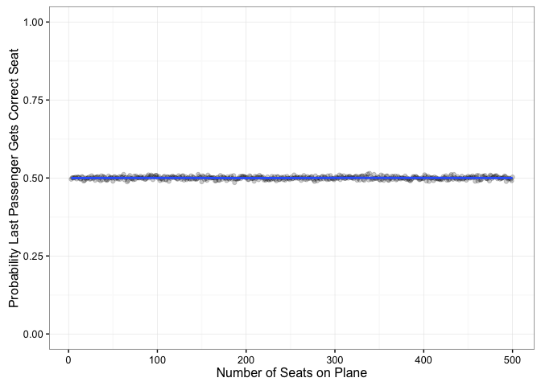
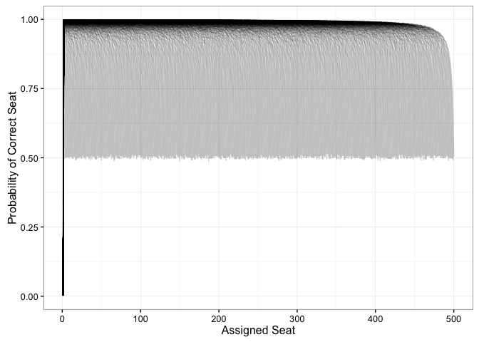

# Untitled
Benjamin Soltoff  
February 19, 2016  


```r
require(dplyr)
```

```
## Loading required package: dplyr
```

```
## 
## Attaching package: 'dplyr'
```

```
## The following objects are masked from 'package:stats':
## 
##     filter, lag
```

```
## The following objects are masked from 'package:base':
## 
##     intersect, setdiff, setequal, union
```

```r
require(ggplot2)
```

```
## Loading required package: ggplot2
```

```r
require(tidyr)
```

```
## Loading required package: tidyr
```

```r
set.seed(11091987)

simulate_seats <- function(seats = 100, planes = 100000) {
  m <- matrix(seq_len(seats), nrow = seats, ncol = planes)
  
  m[1, ] <- sample(seats, planes, replace = TRUE)
  m[cbind(m[1, ], seq_len(planes))] <- 1
  
  for (i in seq(2, seats - 1)) {
    taken <- which(m[i, ] != i)
    
    switch_with <- sample(seq(i, seats), length(taken), replace = TRUE)
    
    replacements <- m[cbind(switch_with, taken)]
    m[cbind(switch_with, taken)] <- m[i, taken]
    m[i, taken] <- replacements
  }
  m
}
```


```r
# sim for flights of between 10 and 853 seats
seats <- 3:500

system.time({
  sims <- lapply(seats, function(x) simulate_seats(seats = x, planes = 10000))
})
```

```
##    user  system elapsed 
##      43      10      54
```

```r
probs <- lapply(seats, function(x) mean(sims[[x - 2]][x, ] == x))
```


```r
data_frame(seats = seats,
           prob = unlist(probs)) %>%
  ggplot(aes(seats, prob)) +
  geom_point(alpha = .2) +
  geom_smooth(se = FALSE) +
  ylim(0,1) +
  labs(x = "Number of Seats on Plane",
       y = "Probability Last Passenger Gets Correct Seat") +
  theme_bw()
```




```r
correct_by_seats <- lapply(sims, function(sim) rowMeans(sim == seq_len(nrow(sim))))

n.obs <- sapply(correct_by_seats, length)
seq.max <- seq_len(max(n.obs))
correct_by_seats <- sapply(correct_by_seats, "[", i = seq.max) %>%
  as.data.frame %>%
  tbl_df %>%
  gather(seats, prob) %>%
  na.omit %>%
  group_by(seats) %>%
  mutate(passenger = seq_len(n())) %>%
  ungroup %>%
  mutate(seats = extract_numeric(seats) + 2)
```


```r
ggplot(correct_by_seats, aes(passenger, prob, group = seats)) +
  geom_line(alpha = .2) +
  labs(x = "Assigned Seat",
       y = "Probability of Correct Seat") +
  theme_bw()
```




