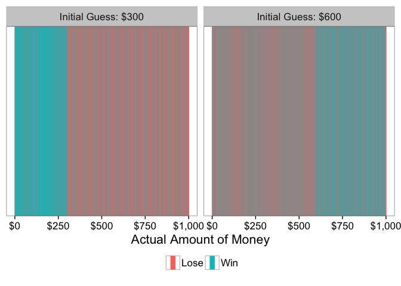

# Can You Win This Hot New Game Show?
Benjamin Soltoff  
March 20, 2016  


The latest [Riddler puzzle on FiveThirtyEight](http://fivethirtyeight.com/features/can-you-best-the-mysterious-man-in-the-trench-coat/):

> A man in a trench coat approaches you and pulls an envelope from his pocket. He tells you that it contains a sum of money in bills, anywhere from $1 up to $1,000. He says that if you can guess the exact amount, you can keep the money. After each of your guesses he will tell you if your guess is too high, or too low. But! You only get nine tries. *What should your first guess be to maximize your expected winnings?*

My solution is based on a basic, yet elegant, strategy. The first guess can be selected arbitrarily between $1 and $1000 - let's say here that my first guess is $500. If my guess is correct, then I'm done (yay!). But since I have just a 1 in 1000 probability of guessing correctly on the first try, I'm probably not done. So if the trenchcoat man says the actual value is higher, my next guess will be the midway point between my first guess and the maximum possible value. Initially, this will be $1000. If the trenchcoat man says the actual value is lower, my next guess will be the midway point between my first guess and the minimum possible value ($1).

So let's say my guess is too low and the actual value is higher. My second guess would be $750. If I'm correct, I win. If actual value is lower, my next guess will be the midpoint between $500 and $750 - remember that I now know it must be within this range.

I can iterate through this process with up to 9 guesses. At that point, if I still have not guessed the value, I lose.

To simulate this process in `R`, I wrote the following function


```r
require(dplyr)
require(magrittr)
require(ggplot2)
require(ggrepel)

set.seed(11091987)

# function to guess money amount using strategy
guess_money <- function(actual, initial, n_tries = 9, min_val = 1, max_val = 1000,
                        print_guess = FALSE){
  # set iterator
  i <- 1
  
  # while i is less than the max number of guesses, find the median value
  # within the possible range. if guess is not correct, reset min_val or max_val
  # depending on info trenchcoat man provides
  while(i <= n_tries){
    if(i == 1){
      guess <- initial
    } else{
      guess <- round(mean(c(min_val, max_val)))
    }
    
    # print the guess if print_guess is TRUE
    if(print_guess) cat(paste0("Guess Number ", i, ": $", guess), sep = "\n")

    # if guess is correct, immediately exit the loop and return true
    # if guess is not correct:
    ## if actual is higher than guess, change min_val to guess
    ## if actual is lower than guess, change max_val to guess
    if(actual == guess){
      return(c(win = TRUE, round = i))
    } else if(actual > guess) {
      min_val <- guess
    } else if(actual < guess) {
      max_val <- guess
    }
    
    # iterate to next round if guess was incorrect
    i <- i + 1
  }
  
  # at this point still have not guessed the money amount, so lose
  # correct i since we didn't really guess the i-th time
  return(c(win = FALSE, round = i - 1))
}
```

As an example, let's say the actual amount of money is $736 and my first guess is $500. Here's how that would play out:


```r
guess_money(736, 500, print_guess = TRUE)
```

```
## [1] 500
## [1] 750
## [1] 625
## [1] 688
## [1] 719
## [1] 734
## [1] 742
## [1] 738
## [1] 736
```

```
##   win round 
##     1     9
```

This tells me the different guesses, as well as the fact that I eventually won (win = 1) in the ninth round.

Of course, there is no reason why I have to choose $500 for my initial guess. What if I instead started at $1?


```r
guess_money(736, 1, print_guess = TRUE)
```

```
## Guess Number 1: $1
## Guess Number 2: $500
## Guess Number 3: $750
## Guess Number 4: $625
## Guess Number 5: $688
## Guess Number 6: $719
## Guess Number 7: $734
## Guess Number 8: $742
## Guess Number 9: $738
```

```
##   win round 
##     0     9
```

Clearly not the best initial guess. I wasted my first guess and ended up not winning the money. But how do we know which initial guess provides the highest *expected value*? That is, the initial guess that maximizes my potential winnings regardless of the actual amount of money held by the trenchcoat man?

To answer that question, I can calculate the results for every potential initial guess (each integer between 1 and 1000) and every potential actual amount of money (again, each integer between 1 and 1000). This results in 1,000,000 different outcomes. From there, we can calculate the average winnings for each initial guess. These average winnings are the expected value, or what we might expect to win.

In order to do this in `R`, I use the `Vectorize` function to expand my original function to work with multiple game states.


```r
min_val <- 1
max_val <- 1000
actual_vals <- min_val:max_val
guess_vals <- min_val:max_val

data <- expand.grid(actual = actual_vals, guess = guess_vals) %>%
    tbl_df
data
```

```
## Source: local data frame [1,000,000 x 2]
## 
##    actual guess
##     (int) (int)
## 1       1     1
## 2       2     1
## 3       3     1
## 4       4     1
## 5       5     1
## 6       6     1
## 7       7     1
## 8       8     1
## 9       9     1
## 10     10     1
## ..    ...   ...
```

```r
result <- with(data, Vectorize(guess_money)(actual = actual, initial = guess,
                                            min_val = min_val, max_val = max_val))
  
both <- bind_cols(data, t(result) %>%
                    as.data.frame)
both
```

```
## Source: local data frame [1,000,000 x 4]
## 
##    actual guess   win round
##     (int) (int) (dbl) (dbl)
## 1       1     1     1     1
## 2       2     1     0     9
## 3       3     1     0     9
## 4       4     1     1     9
## 5       5     1     0     9
## 6       6     1     0     9
## 7       7     1     0     9
## 8       8     1     1     8
## 9       9     1     0     9
## 10     10     1     0     9
## ..    ...   ...   ...   ...
```

Now that we have all the potential outcomes of the game, I can calculate the expected winnings for each initial guess and find the best starting point.


```r
exp_val <- both %>%
  group_by(guess) %>%
  summarize(win_rate = mean(win),
            exp_val = mean(actual * win)) %>%
  ungroup
exp_val
```

```
## Source: local data frame [1,000 x 3]
## 
##    guess win_rate exp_val
##    (int)    (dbl)   (dbl)
## 1      1    0.256   127.5
## 2      2    0.256   127.8
## 3      3    0.257   127.9
## 4      4    0.258   128.0
## 5      5    0.259   128.1
## 6      6    0.260   128.3
## 7      7    0.261   128.5
## 8      8    0.262   128.6
## 9      9    0.263   128.6
## 10    10    0.264   128.8
## ..   ...      ...     ...
```

```r
exp_val_max <- exp_val %>%
  filter(exp_val == max(exp_val))

ggplot(exp_val, aes(guess, exp_val)) +
  geom_line() +
  geom_point(data = exp_val_max) +
  geom_text(data = exp_val_max, aes(label = paste0("$", guess)),
            hjust = -.25) +
  scale_x_continuous(labels = scales::dollar) +
  scale_y_continuous(labels = scales::dollar) +
  labs(x = "Initial Guess",
       y = "Average Winnings") +
  theme_bw(base_size = 16)
```


So if you get up to nine guesses, your first guess should be $744. Why is it not $500? Shouldn't that be optimal, since it minimizes the potential range of values for which you'll need to initially account? Well, not quite.

There are a range of initial guesses that provide you the same overall win rate.


```r
both %>%
  group_by(guess) %>%
  summarize(win_rate = mean(win)) %>%
  ggplot(aes(guess, win_rate)) +
  geom_line() +
  scale_x_continuous(labels = scales::dollar) +
  scale_y_continuous(labels = scales::percent) +
  labs(x = "Initial Guess",
       y = "Win Rate") +
  theme_bw(base_size = 16)
```


The win rate for initially guessing $300 is the same as for initially guessing $600 - 51.1%. However the expected value for initially guessing $300 is just $204, compared to initially guessing $600 ($281). But which actual values can you win before you run out of attempts?


```r
both %>%
  filter(guess == 300 | guess == 600) %>%
  mutate(win = factor(win, levels = 0:1, labels = c("Lose", "Win")),
         guess = factor(guess, labels = c("Initial Guess: $300",
                                          "Initial Guess: $600"))) %>%
  ggplot(aes(x = actual, color = win)) +
  facet_wrap(~ guess) +
  geom_vline(aes(xintercept = actual, color = win)) +
  labs(x = "Actual Amount of Money",
       color = NULL) +
  scale_x_continuous(labels = scales::dollar) +
  theme_bw(base_size = 16) +
  theme(legend.position = "bottom") +
  guides(color = guide_legend(override.aes = list(size=3)))
```



This is the crux: lower starting guesses allow you to win at the same rate, but when you win it's because you guessed a lower number. More directly, you win at the same rate but each set of winnings is smaller.

## More (or Fewer) Guesses

But what if we modify the game rules so that you get fewer guesses? Or more guesses? How does the number of attempts change the optimal starting guess?

Here I do the same thing as before, but I vary the number of tries the player gets for each set of simulations.


```r
guess_money_mult <- function(n_tries = 1, min_val = 1, max_val = 1000){
  actual_vals <- min_val:max_val
  guess_vals <- min_val:max_val
  
  data <- expand.grid(actual = actual_vals, guess = guess_vals) %>%
    tbl_df
  
  result <- with(data, Vectorize(guess_money)(actual = actual, initial = guess,
                                              n_tries = n_tries,
                                              min_val = min_val, max_val = max_val))
  
  both <- bind_cols(data, t(result) %>%
                      as.data.frame) %>%
    mutate(n_tries = n_tries)
  
  return(both)
}

tries_all <- lapply(1:12, function(x) guess_money_mult(n_tries = x)) %>%
  bind_rows
```


```r
tries_all_exp <- tries_all %>%
  mutate(n_tries = factor(n_tries)) %>%
  group_by(guess, n_tries) %>%
  summarize(win_rate = mean(win),
            exp_val = mean(actual * win))

tries_all_exp_max <- tries_all_exp %>%
  group_by(n_tries) %>%
  filter(exp_val == max(exp_val)) %>%
  arrange(-exp_val) %>%
  slice(1)

ggplot(tries_all_exp, aes(guess, exp_val,
                          group = n_tries, color = n_tries)) +
  geom_line() +
  geom_point(data = tries_all_exp_max) +
  geom_label_repel(data = tries_all_exp_max, aes(label = paste0("$", guess)),
            show.legend = FALSE) +
  scale_x_continuous(labels = scales::dollar) +
  scale_y_continuous(labels = scales::dollar) +
  scale_color_discrete(guide = guide_legend(reverse = TRUE)) +
  labs(x = "Initial Guess",
       y = "Expected Value",
       color = "Number of\nGuesses",
       group = "Number of\nGuesses") +
  theme_bw(base_size = 16)
```


The fewer guesses you receive, the higher your initial guess must be to maximize your expected winnings. If you had 12 or more guesses, it simply does not matter what your initial guess is: you can always win using my proposed strategy.


